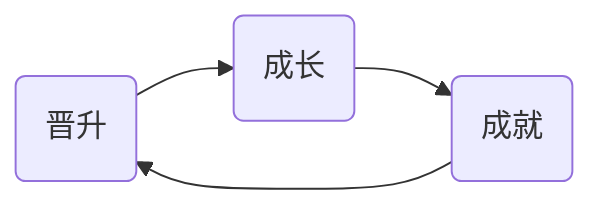
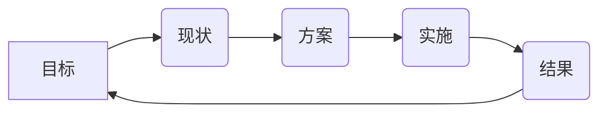

# 工程体系

### 优秀工程师
1. **领域知识**，且要串联起来
2. **能力**：编程能力、架构能力、工程能力
**潜力**：基础打牢
3. **职业规划**：*工程师->资深工程师->专家->经理*
不规划职业就没成长
4. **成就**：教育经历、职业经历
心得体验公开发表也是一项成就

### 职业规划
谁是你职业发展的负责人？
成长机会之一：开源项目

### 职业发展

如果卡住，通过跳槽、报班、发起项目等突破

### 业务型成就
- 业务目标
    + 理解公司业务的核心目标
    + 目标转化为指标
- 技术方案
    + 业务指标到技术指标的转化
    + 形成直面方案、完成小规模试验
- 实施方案
    + 确定实施目标、参与人
    + 管理实施进度
- 结果评估
    + 数据采集、数据报表
    + 向上报告

*技术上的改进可能形成业务上的巨大改进*

### 解决技术难题成就
目标：公认的技术难点（公司：团队公认 简历：行业公认）
方案与实施： 依靠扎实的编程能力、架构能力形成解决方案
结果：问题解决

### 工程型成就
目标： 质量、效率
方案与实施：
* 规章适度
* 库
* 工具
* 系统

结果： 线上监控

> **参与开源文档方法:**
    1. 帮写文档
    2. fix bug
    3. 单步追踪
    4. 提交作者review

### 数据驱动的思考方式
活跃度=日活/月活

1. **目标** 分析业务目标定数据指标
~~踏实肯干~~不是好评价
业务敏感度不懂的话很吃亏
2. **现状** 采集数据建立数据展示系统
跟要有对比
采集数据，技术数据加载时间performance、错误数据onerror
3. **方案** 设计技术方案预估数据
需要预估数据（数量级对即可），拉人入伙
4. **实施** 小规模试验推广全公司落地形成制度
5. **结果** 统计最终效果汇报
老黄牛，不汇报。不正式汇报座位讲一讲，正式写个ppt，如果不汇报，事情相当于没做

### 前端技能模型
领域知识
前端知识
编程能力 架构能力 工程能力

### 工具链
+ 工具链的作用
+ 工具的分类
    * 脚手架 init
    * 本地调试 run
    * 单元测试 test
        > 代码覆盖率
    * 发布 publish
+ 工具链体系的设计
    * 版本问题
    * 数据统计（什么时候run下，安了什么组件，发布了多少次，单元测试执行了多少次，init了多少项目）

### 持续集成
客户端软件持续集成
* Daily build
* BVT

前端持续集成
* Check-in build
* Lint + Rule Check

前端天然解耦
Check-in build每次提交都build
Rule Check规则检查（无头浏览器）

### 技术架构
客户端架构：解决软件需求规模带来的复杂性
服务端架构：解决大量用户访问带来的复杂性
前端架构： **解决大量页面需求带来的重复劳动问题**

##### 库：有复用价值的代码
* URL [url标准](https://tools.ietf.org/html/rfc3986)
* AJAX *防攻击窃取，时间戳+摘要+校验*
* ENV *(UA)*

##### 组件：UI上多次出现的元素
* 轮播
* Tab

组件的定义和基础设施，就是**组件化方案**

##### 模块：经常被使用的业务区块
* 登录

#### 答疑
* 眼里有活儿
技术上工程思维，解决问题的技术能力，实现系统架构能力，业务敏感度

* 设计模式，可学可不学

* 推荐公众号：前端之巅

* 学习单元测试开源项目：spritejs

* 龙书

* 关于Node
不要轻视Node服务端，涉及到线上的一定小心

* 关于前端优化：
前端优化不在于掌握更多知识，而是在于正确的用[数据驱动的思考方式](#数据驱动的思考方式)这五个步骤做事。

* 应聘关键：用成就证明自己