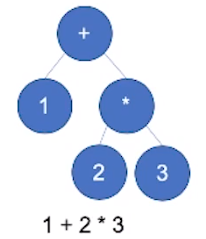

## JavaScript | 表达式 Expression，类型转换
电梯：[week03 class02 笔记](./NOTE2.md)

[TOC]
### Grammar

#### Tree vs Priority
* \+ \-
* \* \/
* ()



#### 1. Member运算符（优先级最高）
* a.b
* a[b] *覆盖Java反射机制*
* foo\`string\`
* super.b
* super['b']
* `new.target` *判断对象是构造器new出来的唯一方法*
* new Foo()

`new.target` [属性参考](https://developer.mozilla.org/zh-CN/docs/Web/JavaScript/Reference/Operators/new.target)  
```javascript
function foo(){
    console.log(new.target)
}
foo();
// output: undefined
new foo();
// output: foo{}

// 伪造fakeObject成是foo构造出来的，在new.target出现之前没有任何办法判断
var fakeObject = {};
Object.setPrototypeOf(fakeObject, foo.prototype); // 指定fakeObject的__proto__
fakeObject.constructor = foo;
//foo.apply(fakeObject);
```
`super` 调用父类
```javascript
class Parent{
    constructor(){
        this.a = 1;
    }
}
class Child extends Parent{
    constructor(){
        super(); // 必须先调用下父类选择器，下边的this.a才能访问到
        console.log(this.a);
    }
}
new Child
// output: [Object] Child {a:1}
```
String Template:  foo\`string\`
```javascript
var name = 'yhxang';
function foo(){
    console.log(arguments)
}
foo`Hello ${name}!`
// 可以观察返回的arguments值，分别是成员为'Hello '和'!'的Array，和传入的变量'yhxang'
```

#### 2. New（当没有括号时）
* new Foo
*new Foo()优先级高于new Foo*

Example:  
`new a()()`  
`new new a()`

```javascript
function cls1(s){
    console.log(s);
}
function cls2(s){
    console.log('2', s);
    return cls1;
}
new new cls2("good")
//output: 2 good
//可以看出new foo时带括号的优先级更高，上边等价于new (new cls2("good"))
```
* Reference
    * 组成：
        * Object
        * Key
    * 可以写的运算符：
        * delete
        * assign

Member expression返回的是Reference类型
*Reference和直接量在读的时候没什么两样，只有在写的时候表现不同*

```javascript
var o = {x:1}
o.x + 2
//output: 3
1 + 2
//output: 3
delete o.x
delete 1
//二者不同，因为o.x实际上是一个Reference类型
```
#### 3. Call
* foo()
* super()
* foo()['b']
* foo().b
* foo()`abc`
```javascript
class foo{
    constructor(){
        this.b = 1;
    }
}
new foo()['b']
new foo().b
//output: 1
// a.b、a["b"]若跟在foo()后边，优先级降下来了
foo["b"] = function(){}
new foo["b"]
//output: [Object] foo.b {}
// 等效于new (foo["b"])
```

* Left Handside & Right Handside
Left Handside是Reference

#### 4.Update
* a ++
* a --
* -- a
* ++ a

#### 5.Unary(单目预算符)
* delete a.b
* void foo()
* typeof a
* +a
* -a
* ~a
* !a
* await a


`void`是运算符，可以把任何值转为`undefined`，最好用`void 0`替换`undefined`，因为`undefined`是个变量可能被覆盖。  
```diff
for (var i=0; i<10; i++){
    var button=document.createElement("button");
    document.body.appendChild(button);
    button.innerHTML=i;
-   button.onclick=function(){
-       console.log(i)
-   }

-   + function(i){
+   void function(i){
        button.onclick=function(){
            console.log(i)
        }
    }(i)
}
// void可以避免忘加分号与后边的IIFE粘连的情况
```
* typeof
```javascript
typeof null
//output: 'object'v
typeof function(){}
//output: 'function'
//Object.prototype.toString.call()无法区分包装类型和原始类型，比如 "str" 和 new String("str")
```
#### 6.Exponental
* `**` *(右结合)*
#### 7.Multiplicative
* `* / %`
#### 8.Additive
* `+ -`
#### 9.Shift
* `<< >> >>>`
*左移一位相当于乘以x（2），右移一位相当于除以x（2）*
#### 10.RelationShip
* `<  >  <=  >=  instanceof  in`
#### 11.Equality
* `==`
* `!=`
* `===`
* `!==`
#### 12. Bitwise
* `& ^ |`
#### 13.Logical（有短路逻辑）
* `&&`
* `||`
#### 14.Conditional
* `?:`
#### 15.逗号（分号的表达式版）
* `,`
### 类型转换
|   |Number|String|Boolean|Undefined|Null|Object|Symbol|
|-- |-- |-- |-- |-- |-- |-- |-- |
|Number|- |-- |0 false|x |x |Boxing |x |
|String|  |- |"" false|x |x |Boxing |x |
|Boolean|true 1<br>false 0 |'true' 'false' |-|x |x |Boxing |x |
|Undefined| NaN |'Undefined' |false|- |x |x |x |
|Null| 0 |'null' |false|x |- |x |x |
|Object| valueOf |valueOf<br>toString |true|x |x |- |x |
|Symbol| x |x |x|x |x |Boxing |- |

##### Boxing & Unboxing
* [ToPrimitive](https://developer.mozilla.org/zh-CN/docs/Web/JavaScript/Reference/Global_Objects/Symbol/toPrimitive)
* ToString vs valueOf

可装箱的类型： Number、String、Boolean、Symbol  

**Boxing示例:**
```javascript
new Number(1) //Boxing

new String('hello').length
//output: 5
'hello'.length
//output: 5
typeof 'hello'
//output: "string"
typeof new String('hello')
//output: "object"

! new String("")
//output: false
!""
//output: true

//Number String Boolean如果不用new，会直接转类型，Number(1)输出数字1，而不是Number对象 

//另外还可以用Object装箱，Object和new Object都可以
Object(1)  //output：[object] Number{1}
new Object('str')  //output：[object] String{"str"}
Object(true)  //output：[object] Boolean{true}

Symbol('x')
//Symbol除了不可new，所有对象的操作都有
Object(Symbol('x')) //可以Object装箱
Object(Symbol('x')).constructor 
//output: [function] Symbol(){} 
Object.getPrototypeOf(Object(Symbol('x'))) === Symbol.prototype
//output: true
Object(Symbol('x')) instanceof Symbol
//output: true
(function(){return this}).apply(Symbol('x')) //这种也可以装箱
//output: [Symbol] {Symbol(x)} 
```
**Unboxing示例：**
```javascript
1 + {}
//output: 1[object Object]
1 + {valueOf(){return 2}}
//output: 3
1 + {toString(){return 2}}
//output: 3
1 + {valueOf(){return 1}, toString(){return "2"}} 
//output: 2
"1" + {valueOf(){return 1}, toString(){return "2"}} 
//output: "11"
"1" + {valueOf(){return }, toString(){return "2"}} 
//output: "1undefined"
1 + {[Symbol.toPrimitive](){ return 6}, valueOf(){return 1}, toString(){return "2"}} 
//output: 7
1 + {[Symbol.toPrimitive](){ return {}}, valueOf(){return 1}, toString(){return "2"}} 
// TypeError: Cannot convert object to primitive value
"1" + {valueOf(){return {}}, toString(){return 2}}
//output: "12"
```
上例可见，`Symbol.toPrimitive`优先级最高，如果有`Symbol.toPrimitive`则只调用`Symbol.toPrimitive`，如果没有的话，会执行一个默认的`toPrimitive`，这个默认的`toPrimitive`会优先调用`valueOf`，如果转换失败再调用`toString`。  
`toPrimitive`相当于把钩子接管了，`valueOf``toString`是默认逻辑。

**迷惑行为：**
```javascript
//test1与test2区别仅在于hint为default时返回的是string还是boolean
var test1 = {
    [Symbol.toPrimitive](hint){
        console.log(hint); 
        if(hint=='number'){
            return 10;
        }else if(hint=='string'){
            return 'hello';
        }
        return 'true'; // String
    }, 
    valueOf(){ return 1 }, 
    toString(){ return "2" }
}
var test2 = {
    [Symbol.toPrimitive](hint){
        console.log(hint); 
        if(hint=='number'){
            return 10;
        }else if(hint=='string'){
            return 'hello';
        }
        return true; // Boolean
    }, 
    valueOf(){ return 1 }, 
    toString(){ return "2" }
}
10 + test1
//output: default
//output： "10yhx"
10 + test2
//output: default
//output： "11"
```
结果说明似乎当`hint`为`default`时，如果`toPrimitive`返回`true`，则回去调用`valueOf`。此行为比较迷惑。

### 答疑
* 极数0.9999... = 1
* `Set`数据结构的意义，为了解决js中缺少可哈希结构的缺陷，例如判断对象是不是已有对象中的一个
* 测试Number的case可以去tc39的 [test262](https://github.com/tc39/test262/tree/master/test/language/literals/numeric) 项目中找。
* 无法获取在计算机真实存储的值，获取也没有意义，因为有的引擎是虚拟机，有的是解释器，实现不一致。
* 
