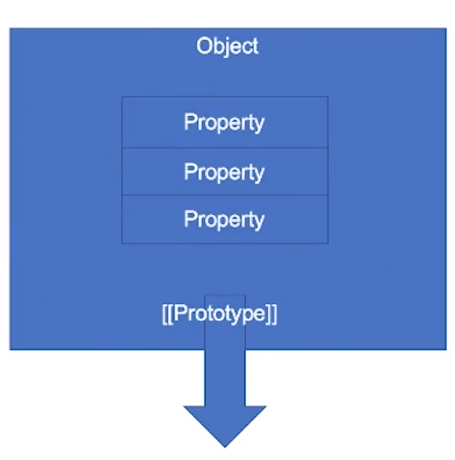

## JavaScript | 语句 Statement，对象
电梯：[week03 class01 笔记](./NOTE.md)

### Grammar
* 简单语句
* 组合语句
* 声明
### Runtime
* Completion Record *（完成的记录）*
    * [\[type]]: normal, break, continue, return, or throw
    * [\[value]]: Types
    * [\[target]]: label *为了break，continue存在*
* Lexical Environment
---
### Grammar
#### 简单语句
* ExpressionStatement *([\[type]]:normal)*
    `a = 1 + 2;`
* EmptyStatement *([\[type]]:normal)*
    `;`
* DebuggerStatement *([\[type]]:normal)*
    `debugger`
* ThrowStatment
    `throw a`
* ContinueStatement
    `continue label1`
* BreakStatement
    `break label2`
* ReturnStatement
    `return 1 + 2`
#### 组合语句
* BlockStatement
    * [\[type]]: normal
    * [\[value]]: --
    * [\[target]]: --

    结构是block花括号括起来的部分，对象花括号不允许出现在语句的开头，如果出现在语句头部一定是block。例如：
    ```javascript
    {
        a : 1
    }
    ```
    这个语句会被理解为block而不是对象，a 则是 label。  
    ES6中可用作let、const作用域。  
    如果block中出现非normal类型，会中断，如出现throw等。

* IfStatement
* SwitchStatement
* IterationStatement
* WithStatement
* LabelledStatement
* TryStatement
    try语句不能省略花括号，唯一一种从函数内部蔓延到外部的Completion Record类型。
    ```javaScript
    try{
        throw 2;
    }catch(e){
        // 与for的括号不同，这儿没有父子作用域，只有一个作用域。
        console.log(e)
    }finally{

    }
    ```
    术语**作用域**指的是代码作用文本的范围，不关心运行时。**上下文**指用户已执行的电脑上内存存变量的地方。

**Iteration**
* **while(** *Expression* **){** *block* **}**
* **do{** *block* **}while(** *Expression*  **)**
* **for(** *VariableDeclarationList* **;** *Expression* **;** *Expression* **){ }**
    for循环圆括号中的let和大括号中的let是两个父子作用域，var则不受声明位置限制。
* **for(** *VariableDeclarationList* **in** *Expression* **){ }**
    ```javascript
    for(let p in {a:1, b:2}){
        console.log(p)
    }
    ```
* **for(** *VariableDeclarationList* **of** *Expression* **){ }** *访问有迭代的结构 Generator/Array*
    ```javascript
    for(let q of [1,2,3]){
        console.log(q);
    }

    function *g(){
        yield 0;
        yield 1;
        yield 4;
    }
    for(let p of g()){
        console.log(p)
    }
    ```
    for of实质是访问Iterator，然后访问Generator/Array
* ~~for await( of )~~

#### 声明
* FunctionDeclaration
    ```javascript
    function foo(){ }
    //函数声明
    var o = function foo(){ }
    //函数表达式可省略名字，但不能出现在语句开头

    //class同理
    class cls{ }
    var cls1 = class{ } 
    ``` 
* GeneratorDeclaration
    ```javascript
    function* foo(){
        yield 1; 
        yield 2;
        var i = 3;
        while(true)
            yield i++;
    }
    var gen = foo();
    gen.next();
    gen.next();
    //...
    //var o = function* foo(){ } //表达式
    ```
    generator跟异步async没有关系，只是刚好可以模拟await。
    术语结构化编程的一部分，可以为编程方式多一个选项
* AsyncFunctionDeclaration
    ```javascript
    function sleep(d){
        return new Promise(resolve => setTimeout(resolve, d))
    }
    void async function(){
        var i = 0;
        while(true){
            console.log(i++);
            await sleep(1000);
        }
    }()
    //output: 1 2 3 4 ...
    ```
* AsyncGeneratorDeclaration
    ```javascript
    function sleep(d){
        return new Promise(resolve => setTimeout(resolve, d));
    }
    async function* foo(){
        var i = 0;
        while(true) {
            yield i++;
            await sleep(1000);
        }
    }
    void async function(){
        var g = foo();
        //console.log(await g.next())
        //console.log(await g.next())
        //console.log(await g.next())
        //console.log(await g.next())
        //console.log(await g.next())
        for await(let e of g){
            console.log(e)
        }
    }()
    ```
* VariableStatement
    `var`声明出现在函数的任何位置效果都是相同的，即使在 `if(false){var ...}` 范围内也如此
    ```javascript
    var x = 0;
    function foo(){
        var o = {x : 1}
        x = 2;
        with(o) {
            var x = 3;
            // x = 3; //如果去掉var，下边分别output：2 2，
            //var的存在与否改变了上边x=2的行为，因为var的作用范围在无论放在函数内哪儿都一样；即使在 if(false){var ...}范围内
        }
        console.log(x);
    }
    foo(); //output: 2
    console.log(x); //output:  0
    ```
    建议：var类型变量要写在前边，不要再block内写var
* ClassDeclaration
* LexicalDeclaration

### 对象Object
* 对象具有**唯一**标识性
* 对象是有**状态**的，即使状态一致的对象也不相等
* 对象是有**行为**的，状态的改变即是行为

面向对象特点是封装、继承、多态的说法不准确：
* 封装、内聚、复用、解耦是同一层概念，是架构上的概念，代码架构的合理性。
* 继承是面向对象的子系统
* 多态描述动态性的程度
#### Object——Class
类是一种常见的描述对象的方式，“归类”和“分类”是两个主要的流派。  
对于“归类”方法而言，多继承是非常自然的事情，如C++。但是基于这种底层逻辑会出现复杂的菱形继承（一个类的两个父类继承自同一个基类）。  
而采用分类思想的计算机语言则是单继承结构，并且会有一个基类（Object）。如Java、C#。但当需要两个分支的类抽象到一起的情况时，需要添加interface接口机制。为解决复用的问题，出现Mixin。
#### Object——Prototype
JavaScript选的面向对象则流派是基于原型。  
原型是一种更接近人类原始人之的描述对象的方法。  
我们并不试图做严谨的分类，而是采用“相似”这样的方式去描述对象。  
> 例如要描述一只羊，只要去找一只比较典型的羊描述清楚，接下来描述具体每一只羊时，只需要描述比这个典型的羊高矮胖瘦等。

任何对象仅仅需要描述它自己与原型的区别即可。

**狗咬人，咬这个行为该如何使用对象抽象:**  
狗咬人，咬是谁的行为？答案是人，因为状态的改变即是行为，狗咬人，人的状态变了（正常->受伤）。所以，下边这段代码是不合适的：
```
class Dog{
    bite(human){
        //.....
    }
}
```
我们不应该受到语言描述的干扰。在设计对象的状态和行为时，我们总是应该遵循“**行为改变状态**”的原则。因此，应该替换为下边的代码：
```
class Human{
    hurt(damage){
        //...
    }
}
```
所有对象的行为必须是改变自身状态的行为，跟日常讲的行为不一样。面向对象并非是尽量贴近生活的语言描述，程序员需要做的应该是先对事情有效抽象，用抽象的语言描述，而不要贴着产品经理的描述设计代码。  
*看一个class设计的好不好，对着每一个方法看命名，如果命名听起来不像改变自己状态，方法里代码没有改变自身的，那基本都不符合行为。*
> 这些是面向对象编程的入门知识，如果不遵循，设计出的代码很可能是混乱的，享受不到面向对象的好处，只会带来麻烦。如果不会面向对象，直接用面向过程，也可以写出好代码
#### Object in Javascript
在JavaScript运行时，原生对象的描述方式非常简单，我们只需关心原型和属性两个部分。（原型不是属性，属性属于运行时）
  

属性是键值对，键有Symbol/String，值有Data数据属性和Accessor访问器属性。
* Data Property数据属性：*（有四个Attribute特征值）*
    * [\[value]]
    * writable
    * enumerable
    * configurable *（设定了就不能变，因为该特征值也管自己是否可写）*
* Accessor Property数据属性：*（也有四个Attribute特征值）*
    * get
    * set
    * enumerable
    * configurable  
    
get、set都是函数，不遵循set进去get出来一致的规则，和不遵循get不改变状态的规则。  
Accessor是双刃剑，例如访问O.a时一般不应有复杂逻辑，但使用Accessor却可以做出复杂逻辑，所以尽量保守用，但有时在基础库中比较有用。*（vue2.0核心用了Accessor改变vm变化监听）*  

当访问属性时，如果当前对象没有，会沿着原型找原型对象是否有此名称的属性，而原型对象还可能有原型，因此这就是“原型链”的说法。这一算法保证了，每个对象只需要描述自己和原型的区别即可。

#### Object API/Grammar
* 基本面向对象能力： `{} . [] Object.DefineProperty`
* ES5原型API： `Object.create / Object.setPrototypeOf / Object.getPrototypeOf`
* 推荐使用范式：`new / class / extends`
* 运行时是原型，语法是Java：`new / function / prototype`

建议用前三套，不要二三混用。

#### Function Object
Javascript除了上边的一般对象，还有一些特殊对象，如函数对象。函数对象除了具有一般对象的property和prototype外，还有个行为`[[call]]`。  
用function关键字、箭头函数或Function构造器创建的对象，都会有`[[call]]`这个行为。  
用类似f()这样的语法把对象当函数调用时，会访问到`[[call]]`这个行为。如果没有`[[call]]`行为，则会报错。
带了call就是function，带了constructor就是构造器。我们能定义的一般既是function又是constructor，但有些js内置的function是例外。例如`Date()`产生的是字符串，`New Date()`产生的是Date对象。（自定义function最后return不是undefined的对象也可以达到类似行为）

#### Special Object
* Array `[[length]]`
```javascript
var o = [];
o[100] = 1;
o.length //output: 101
Object.getOwnPropertyDescriptor(o, "length");
//output: {value: 101, writable: true, enumerable: false, configurable: false}
```
length不是Accessor的get，而是一个Data Property。length这个Data Property为什么跟着别的东西变，这便是Array的特殊之处，我们是无法用代码模仿length的行为的。

* Object.Prototype `[[setPrototypeOf]]`
```javascript
Object.setPrototypeOf(Object.prototype, {a:1}); //抛错
```
特点是不能给它添加原型了，因为Object.porotype已经是万物之始了。