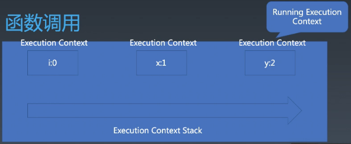

# JavaScript | 结构化程序设计的基础设施

### JS执行粒度
* 宏任务
* 微任务（Promise）
* 函数调用（Execution Context）
* 语句/声明
* 表达式
* 直接量/变量/this...

### Realm
* JS Context => Realm
* 宏任务
* 微任务（Promise）
* 函数调用（Execution Context）
* 语句/声明
* 表达式
* 直接量/变量/this...

JS Context是一般JS引擎包含的最大粒度的东西，比宏任务粒度要大，JS Context对应着一个Global Object，多个宏任务共享一个全局对象，多个宏任务定义的变量、访问的内置对象相通。  
JS Context里最重要的Realm，Realm有一套完整的内置对象。  
  
使用深度优先搜索，在全局对象的属性中查找JavaScript中所有固有对象：  
```javascript
var set = new Set();
var globalProperties = ["eval", "isFinite", "isNaN", "parseFloat", "parseInt", "decodeURI", "decodeURIComponent", "encodeURI", "encodeURIComponent", "Object", "Function", "Boolean", "Symbol", "Error", "EvalError", "RangeError", "ReferenceError", "SyntaxError", "TypeError", "URIError", "Number", "BigInt", "Math", "Date", "String", "RegExp", "Array", "Int8Array", "Uint8Array", "Uint8ClampedArray", "Int16Array", "Uint16Array", "Int32Array", "Uint32Array", "Float32Array", "Float64Array", "BigInt64Array", "BigUint64Array", "Map", "Set", "WeakMap", "WeakSet", "ArrayBuffer", "SharedArrayBuffer", "Atomics", "DataView", "JSON", "Promise", "Reflect", "Proxy", "Intl", "WebAssembly"]
var queue = [];
for (let p of globalProperties){
    queue.push({
        path: [p],
        object: this[p] // this -> window/global
    })
}
let current;
while (queue.length){
    current = queue.shift();
    //console.log(current.path.join("."));
    if(set.has(current.object))
        continue;
    
    set.add(current.object);

    let proto = Object.getPrototypeOf(current.object);
    if(proto && proto !== Function.prototype) {
        queue.push({
            path: current.path.concat(["__proto__"]),
            object: proto
        })
    }
    console.log(current.path.join("."));

    for (let p of Object.getOwnPropertyNames(current.object)){
        var property = Object.getOwnPropertyDescriptor(current.object, p);
        if( (property.value != null && typeof property.value == "object") || (typeof property.value == "function") )
            queue.push({
                path: current.path.concat([p]),
                object: property.value
            });

        if(property.hasOwnProperty("get") && property.get instanceof Object)
            queue.push({
                path: current.path.concat([p]),
                object: property.get
            });
        
        if(property.hasOwnProperty("set") && property.set instanceof Object)
            queue.push({
                path: current.path.concat([p]),
                object: property.set
            });
    }
}
```
  
另外还有从全局访问不到的固有对象：  
```javascript
var args = function(){return arguments;}();
Object.getPrototypeOf(args); //这个是上边的搜索代码取不到的固有对象
```

遍历属性方式：  
```javascript
var obj = {a:1, b:2};
for(let key in obj)
    console.log(key);
//output: a   b // 可枚举属性
for(let key of Object.getOwnPropertyNames(obj))
    console.log(key); // 所有属性
//output: a   b
//Object.keys(obj); //只列举可枚举属性
```
#### 函数调用

```javascript
import {foo} from "foo.js"
var i = 0;
console.log(i);
foo();
console.log(i);
i++;

// foo.js
function foo(){
    var x = 1;
    console.log(x);
}
export foo;
```
相当于：
```diff
var i = 0;
console.log(i);
function foo(){
!   var x = 1;      // 这两句访问不到外面的 “i”
!   console.log(x); // 这两句访问不到外面的 “i”
console.log(i);
i++;
```
另外看更复杂的例子：
```javascript
import {foo} from "foo.js"
var  i = 0;
console.log(i);
foo();
console.log(i);
i++

// foo.js
import {foo2} from "foo2.js"
var x = 1;
function foo(){
    console.log(x);
    foo2();
    console.log(x);
}
export foo;

// foo2.js
var y = 2;
function foo2(){
    console.log(y);
}
export foo2;
```
客观上形成了：
```diff
var i = 0;
console.log(i);
+   console.log(x);         //只能访问x，无法访问i
-       console.log(y);     //只能访问y，无法访问i、x
+   console.log(x);         //只能访问x，无法访问i
console.log(i);
i++
```
||外层|foo.js|foo2.js|
|--|--|--|--|
|Execution Context|i：0| x：1| y：2|
|Execution Context Stack|`var i = 0;`<br>`consoel.log(i);`<br><br><br><br>`consoel.log(i);`<br>`i++;`|`console.log(x);`<br><br>`console.log(x);`|`console.log(y);` 执行完销毁|

此过程形成栈类型的数据结构————Execution Context Stack 执行上下文栈，进入一个函数发生一次Execution Context的push，返回发生一次pop。栈顶的叫Running Execution Context。  
  

##### Execution Context（执行上下文）包含：
* code evaluation state
    * 用于恢复代码执行位置，只有async函数、generator函数需要存才有用，其它直接执行完了pop出了
* Function
    * 执行的任务是函数时使用，表示正在执行的函数，有可能是null
* Script or Module
    * 执行的任务是脚本或者模块时使用，表示正在执行的代码。
* Generator
    * 仅生成器上下文有这个属性，表示当前生成器。记录yield到哪儿了，可能是null
* Realm
    * 使用的基础库和内置对象实例
* LexicalEnvironment（词法环境）
    * 取变量值或this时使用
* VarialbeEnvironment（变量环境）
    * 当声明变量时使用

##### LexicalEnvironment（词法环境）
一种规范类型，用于根据代码的词法嵌套结构来定义标识符与特定变量和函数的关联。  
  
词法环境有一个环境记录（Environment Record）和一个可能为null的外部词法环境（outer Lexical Environment）引用构成。  
  
词法环境与特定语法结构关联，如FunctionDeclaration，BlockStatement或TryStatement的Catch子句，并且每次执行这样的代码时都会创建新的词法环境。
* **全局环境**是一个没有外部环境的词法环境。全局环境的外部环境引用为null。
* **模块环境**是一个包含模块顶层声明绑定的词法环境。模块环境的外部环境是一个全局环境。
* **函数环境**是一个对应于ECMAScript函数对象调用的词法环境。

词法环境内容举例：
* this `this.a = 1;`
    * 箭头函数this是跟变量一起塞进LexicalEnvironment，普通函数是调用的时候塞进去
* new.target `new.target;`
* super `super();`
* 变量 `x += 2;`

##### VarialbeEnvironment
历史包袱，仅用于处理var声明，记录var在哪一层
```javascript
{
    let y = 2;
    eval('var x = 1;');
}
with({a:1}){
    eval('var x;'); // 声明到了函数级别
}
console.log(x);
```
##### Environment Record（环境记录）
Environment Record（词法环境的环境记录）一种规范类型，记录了在其关联的词法环境作用域内创建的标识符绑定。

LexicalEnvironment 和 VarialbeEnvironment 是一个链表结构，里边每一项内容都是一个 Environment Record 基类，它又有三个子类： 
- Environment Record
    - Declarative Environment Records（声明性环境记录）
        + Function Environment Records（函数环境记录）
        + Module Environment Records（模块环境记录）
    - Global Environment Records （全局环境记录）
    - Object Environment Records （对象环境记录）

产生机制实际是Function的Closure原理：
```javascript
var y = 2;
function foo2(){
    var z = 3;
    return function foo3(){
        console.log(y, z);
    }
}
var foo3 = foo2();
export foo3;
```
实际上是：
|Function: foo3|||
| :--: | -- | :--: |
| Environment Record: <br>z:3|outer<br>===><br>链接到| Environment Record:<br>  y:2|
| Code: <br> console.log(y, z); |||

如果上面代码中return的foo3改为箭头函数，则Environment还会增加this：  
```javascript
var y = 2;
function foo2(){
    var z = 3;
    return () => {
        console.log(y, z);
    }
}
var foo3 = foo2();
export foo3;
```
变为了是：
|Function: foo3|||
| :--: | -- | :--: |
| Environment Record: <br>z:3<br>this:global|outer<br>===><br>链接到| Environment Record:<br>  y:2|
| Code: <br> console.log(y, z); |||

##### Realm
一个Realm由一组内部对象，一个ECMAScript全局环境，在该全局环境作用域内接在的所有ECMAScript代码以及其他相关的状态和资源组成。  
  
在JS中，函数表达式和对象直接量会创建对象。使用.做隐式转换也会创建对象。这些对象也是有原型的，如果我们没有Realm，就不知道他们的原型是什么。  

Realm就是一套内置对象，是JavaScript语言领域的概念，iframe可以创建Realm。

```javascript
var iframe = document.createElement("iframe");
document.body.appendChild(iframe);
iframe.contentWindow.eval('this.o = {}');
var o = iframe.contentWindow.o;
Object.getPrototypeOf(o) === Object.prototype; // false
```

  

重要参考：[javascript中词法环境、领域、执行上下文以及作业详解](https://segmentfault.com/a/1190000012162360)