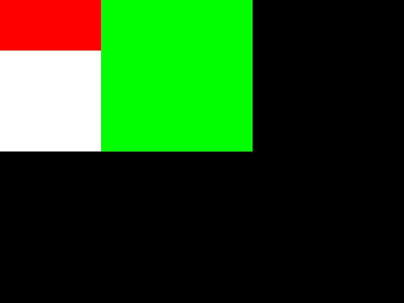
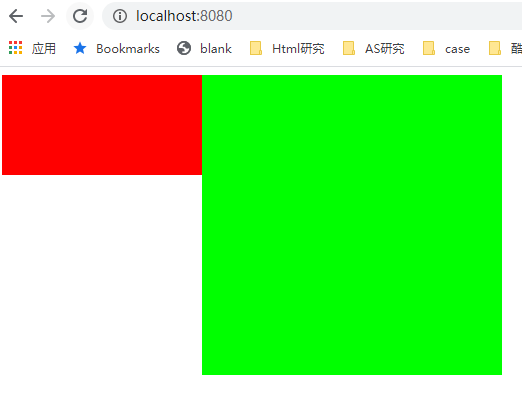

# CSS排版布局

排版Layout技术：
* 第一代排版Normal Flow：  
  代表有display:block/inline/inline-block position:relative/absolute float clear
* 第二代排版技术 flex
* 第三代 grid
* 第四代 houdini

## 收集元素进行
* 根据主轴尺寸，把元素分进行
* 若设置了no-wrap，则强行分配进第一行

[BFC](https://segmentfault.com/a/1190000013023485) (Block Formatting Context)块级格式化上下文。具有 BFC 特性的元素可以看作是隔离了的独立容器，容器里面的元素不会在布局上影响到外面的元素，并且 BFC 具有普通容器所没有的一些特性。*float出现在行中间会导致行重排*

* 计算主轴方向
  * 找出所有flex元素
  * 把主轴方向的剩余尺寸按照比例分配给这些元素
  * 若剩余空间为负数，所有flex元素为0，等比压缩剩余元素

* 计算交叉轴方向
  * 根据每一行中最大元素尺寸计算行高
  * 根据行高flex-align和item-align，确定元素具体位置（align-self）

## 绘制
### 实际浏览器绘制阶段：
1. render 把 dom 变成 bitmap
2. compositing 性能优化手段，把图拼到一起
3. draw（绘制）

### Toy-browser的render步骤：
1. 元素绘制  
    Toy-browser 简化为只有 draw 步骤（函数名还暂为render），采用npm包images，绘制在viewport上，与绘制相关的属性：`background-color`、`border`、`background-image`等。
2. DOM绘制
    * 递归调用子元素的绘制方法完成DOM树的绘制
    * 忽略一些不需要绘制的节点
    * 实际浏览器中，文字绘制是难点，需要依赖字体库，toy-browser忽略
    * 实际浏览器中，还会对一些图层做compositing，toy-brower也忽略

### 结果与验证
* 运行client.js，最后成功得到viewport.jpg:

* 在chrome浏览器验证：

## 知识补漏
* 如果item主轴之和大于外壳宽度，有flex属性的宽度会变成零