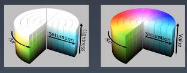

# 重学CSS-动画与绘制
* @keyframes
* animation
* transition
will-change是与composition相关的属性。

# 重学CSS-渲染与颜色
* 颜料三原色（CMYK）：品红、青、黄  
* 光学三原色（RGB）：红、绿、蓝（靛蓝）  
上边是从物理角度描述颜色，但人的直觉是描述这个颜色偏红，这种偏向色相的的描述，所以出现了语义化的标准，HSL与HSV
* HSV： Hue、Saturation（纯度）、Value （WCG采用）
* HSL： Hue、saturation、Lightness  



在面对色相一致、明暗纯度不一致的情况时，HSL/HSV比RGB会好用很多。例如物体自身上边明暗状态（linear-gradient）。
## 形状
会改变div的形状，shader做栅格化。
* border
* box-shadow
* border-radius

* data uri + svg 基本可以得到一切满意的矢量图形。来替代用border做三角形等技巧。

# 重学HTML
HTML的定义：XML与SGML  
SGML的DTD：
https://www.w3.org/TR/xhtml1/DTD/xhtml1-strict.dtd  
DTD完整站在SGML的角度描述了HTML，HTML5已经完全脱离了SGML，不承认DTD。  

一定要记住的HTML实体（html中真正不能出现的字符）：
|Character|HTML Entity（named）|HTML Entity（Decimal）|unicode|
|:-:|-|-|-|
|"|quot|\&#34;|U+0022|
|&|amp|\&#38;|U+0026|
|<|lt|\&#38;#60;|U+003C|
|>|gt|\&#62;|U+003E|

XML的namespace：
https://www.w3.org/1999/xhtml

尽量不用nbsp，防止多空格合并可以用\<pre\>标签或者CSS的white-space: pre-wrap  
HTML5有两种写法，一种是XHTML，严格地遵循XML语法，是XML的子集，另外一种是HTML写法，它并不遵循其它语言的规定，只遵循[HTML的规定](https://html.spec.whatwg.org/multipage/)。 

## 语义
*最早 HTML 是用来写论文的。*
* 可以认为 aside 和 main 是一对，header、footer是文章里的。
* hr表示故事走向的转变或者话题的转变
* dl>dt+dd 可以看做是dfn的列表形态
* cite是引用文章的名，quote是引用文章的内容
* address和email标签都是表示作者的联系地址和email。

### 合法元素
* Element: `<tagname>...</tagname>`
* Text: text
* Comment：`<!--comments-->`
* DocmentType：`<!Doctype html>`
* ProcessingInstruction: `<?a 1?>` *预处理，没啥用*
* CDATA: `<![CDATA[]]>` Text另一种语法

# 重学DOM


## 导航类操作
|Node|Element|
|-|-|
|parentNode|parent|
|childNodes|children|
|firstChild|firstElementChild|
|lastChild|lastElementChild|
|nextSibling|nextElementSibling|
|previousSibling|previousElementSibling|

## 修改操作
* appendChild
* insertBefore
* removeChild
* replaceChild  

**重要的核心认知：**
* 所有的dom元素都默认只有一个父元素，不能被两次插入到dom树中，如果把一个dom插入了A位置和B位置，那么它会默认把A位置remove掉。
* childNodes/chilred 得到的不是JavaScript的数组，而是即时更新的集合（live collection），会被removeChild、appendChild等实时影响。

## 好用的高级操作
* compareDocumentPosition 用于比较两个节点中的关系的函数
* contains 检查一个节点是否包含另一个节点的函数
* isEqualNode 检查两个节点是否完全相同
* isSameNode 检查两个节点是否是同一个节点，实际上在JavaScript中可以用"==="代替
* cloneNode 复制一个节点，如果传入参数true，则会联通子元素做深拷贝

```html
<div id="x">
    <div>1</div>
    <div>2</div>
    <div>3</div>
    <div>4</div>
</div>
<div id="b"></div>
<script>
var x = document.getElementById("x");
var x = document.getElementById("b");
for(var i = 0; i < x.children.length; i++){
    b.appendChild(x.children[i]);
}
</script>
```
上述代码会得到意料外的结果，并不会把#x的四个子节点append到#b里，因为x.children是实时变化的。  
正确的写法应该是：
```html
...
<script>
var x = document.getElementById("x");
var x = document.getElementById("b");
while(x.children.length){
    b.appendChild(x.children[0]);
}
</script>
```

## 重学DOM-Event
DOM API并非为浏览器所有API，如crypto、fetch、web animation。  
DOM API包含DOM树相关API、事件相关API、Range相关API。

## 答疑：
* 页面性能可以用performance API， Lighthouse
* [阿里研究员玄难：如何做电商业务中台](https://yq.aliyun.com/articles/30340)
* 埋点不入侵业务
* koa 洋葱模型