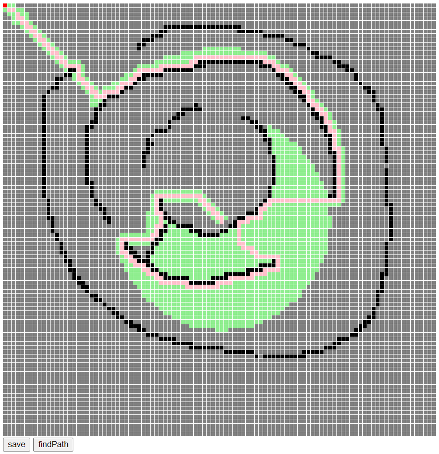

# 每周总结可以写在这里

* 业务逻辑与控制逻辑分开


```javascript
async function* g(){
    yield 1;
    yield 2;
    yield 3;
}
for (let v of g()){
    console.log(v)
}
```


```javascript
async function* g(){
    let i = 0;
    while(true){
        await sleep(1000);
        yield i++;
    }
}
for await (let v of g()){
    console.log(v)
}
```


await 与 then 在运行时都是Promise，语法结构上await优于then。

搜索算法分为深度优先和广度优先，寻路选用的是广度优先，一层一层展开，而深度优先的话，就会一条路走到底，这样的话是找不到最佳路径的。

数据量特别大的情况，要看执行过程，打点解决不了，可以用可视化的方法来观察。

广度和深度搜索，区别在于数据结构，用栈还是队列。递归问题都可以用深度搜索stack的形式写，如果遇到递归栈的深度不够的情况，可以自己建栈，用深度优先的形式代替递归算法。

经典算法问题：**边际距离**，用最少的增删改，把一个字符串改成另外一个。用**动态规划**可以算出需要多少步，要想把每步存下来也需要类似的存pre的办法。**边际距离**算法可以用在dom树的diff算法。

**启发函数**

堆的层数是logN

javascript 中二叉堆不要用left、right等，javascript 对象的开销非常大，要用数组表示。

最终效果：  


**答疑：**
* 双11服务端3分钟提前量，客户端和服务端会校验下时间，用户实在想改也没法防。

> 写代码时，不会有什么api能瞬间帮你解决问题，这些只能帮我们解决一点点问题，最后方案应该是我们把这些api组合起来形成的方案。实际项目中，把Vue落地比Vue要解决的问题要麻烦的多，我们干的活儿可能比尤大干的活儿麻烦。要在已有的基础上，组合形成方案

# 正则表达式
## String.prototype.match
```javascript
"abc".match(/a(b)c/);  // output: ["abc", "b", index: 0, input: "abc", groups: undefined]
"abc".match(/a(b)c/g); // output: ["abc"] //带g会丢失捕获

"abc".match(/a(b)|c/); // output: ["ab", "c"] 也会丢失捕获

"[a=value]".match(/\[([^=]+)=([^\]]+)\]/)
// output:  ["[a=value]", "a", "value", index: 0, input: "[a=value]", groups: undefined]
```
* 带g全局匹配会丢失捕获，用|或也会丢失捕获。所以不推荐match用g。
* 括号会捕捉，如果不想捕捉，只想用圈组，则使用`(?:expression)`放弃捕捉。
## String.prototype.replace
```javascript
"abc".replace(/a(b)c/, (str, $1) => {
    console.log(str, $1)
})
// output: abc b
"abc".replace(/a(b)c/, "$1$1") // output: bb
"abc".replace(/a(b)c/, "$$1$$1") // output: $1$1
```
## RegExp.prototype.exec
exec是正则最重要的用法，分析大型文本复杂文本。test/match/replace用来简单的。  
凭借括号和exec，可以做语法分析
```javascript
let lastIndex = 0;
let token;
do{
    token = inputElement.exec(source);
    console.log(token);
}while(inputElement.lastIndex - lastIndex == token.length)
```