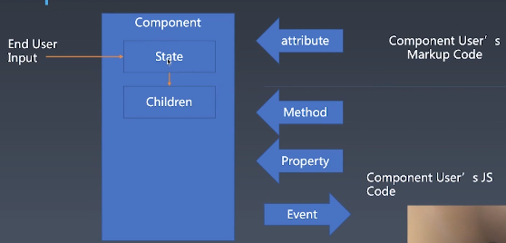

# 组件化基础

前端的架构问题百分之八十都是解决组件化的问题。其他的UI架构模式、基础库需求。 

### 对象与组件：
* 对象
    * properties
    * Methods
    * Inherit
* 组件
    * Properties
    * Methods
    * Inherit  
    * Attribute
    * Config & State 构造时候的设置
    * Event
    * LifeCycle
    * Children 组件树的机制

### Component
  

组件内部有state状态，只会受到终端用户输入一种来源改变。

### Attribute VS Property
Component user's Markup Code 是HTML/JSX标记语言里面设置的，attribute一般是字符串。

Method、property是任何对象都有的，而组件使用对象来抽象的，通过Vue Composition API/React hooks交互方式变不一样，Component通过Event事件把内部状态传递出去。

Atrribute（特性） vs Property  
JS里通过`Object.getOwnPropertyDescriptor`可以获取到Property的Attribute。   
Attribute 强调描述性  
Property 强调从属关系  

HTML里无法设置Property，只能改Attribute。  
Attribute:  
```html
<my-component attribute="v" />
myComponent.getAttribute("a");
myComponent.setAttribute("a", "value");
```

Property:  
```javascript
myComponent.a = "value"
```

大部分Attribute与Property都一致，例如 id Attribute 和 id Property 一致，但也有例外，比如class Attribute 与 className/classList Property。原因是class曾经是个关键字，不允许出现在属性位置。*React里不分 Property 和 Attribute。*  

```html
<div class="cls1 cls2"></div>
<script>
var div = document.getElementByTagName('div');
div.className; //cls1 cls2 
</script>
```

另外一个是style语法，在html里Attribute语法是分号分割冒号键值对，在JS里Property是style是对象。  

href在JS里Property取出来是resolve过的结果，而Attribute取出来的跟HTML代码中完全一致：  
```html
<a href="//m.taobao.com"></a>
<script>
var a = document.getElementByTagName('a');
a.href  // "http://m.taobao.com"
a.getAttribute('href') // "//m.taobao.com"
</script>
```

input的value的Attribute和Property，如果property未设置，则Attribute是什么，Property就是什么；然而当Property一旦设置了，Attribute就不变了，只有Property变。在这里可以把Attribute理解为Property的默认值。  
```html
<input value = "cute">
<script>
var input = document.getElementByTagName('input'); // 若property没有设置，则结果是attribute
input.value // cute
input.getAttribute('value') // cute
input.value = 'hello'; // 若value属性已经设置，则attribute不变，property变化，元素上实际效果是property有限
input.value // hello
input.getAttribute('value') // cute

// jqurey中
$('input').attr()
$('input').value();  // value简化为val
$('input').val();
</script>
```

### 如何设计组件状态
|Markup set|JS set|JS change |User Input Change| |
|-|-|-|-|-|
|❌|✔️|✔️|❓|Property|
|✔️|✔️|✔️|❓|Attribute|
|❌|❌|❌|✔️|state|
|❌|✔️|❌|❌|config|

组件体系基本框架：
```javascript
class myComponent extends Component{
    constructor(config){ // config 全局设置，一般不改，而是直接用<myComponent> 声明式创建
        this.state = {
            i: 1
        }
    }
    get prop1(){}
    set prop1(){}

    mounted(){}

    render(){}

    getAttribute(attr){}
    setAttribute(attr, value){}

    get children(){}
    set children(){}
}

// <myComponent attr1="33">
```

```html
<!-- react风格：-->
let myComponent = <myComponent >
    <div></div>   <!-- children -->
</myComponent > 

<!-- vue风格：-->
<template>
    <myComponent $ref="abc" class="2">
        <div></div>   <!-- children -->
    </myComponent > 
</template>
<script>
    export default {
        mounted(){
            this.$ref['abc'].class = 1;
        }
    }
</script>
```
组件是UI范畴的，任何一个组件化框架都是等价于用JS写出来。一般都是声明式写法，不要new出来，就像做界面不会用`document.createElement`去构造。  

### LifeCycle
组件从创建开始到销毁截止，它有几个身不由己的时刻，一个是created创建，一个是destroyed销毁。  

  

* 被mount前子组件是没有CSSOM的，因为没有位置。  
* JS改变attr/prop时也需要组件做出相应变更。  
* 用户输入也会触发事件。  

### Children
Content型Children与Template型的Children
```html
<!--Content型Children-->
<!--有多少img就有多少个图片-->
<my-button>{{title}}</my-button>

<!--Template型的Children-->
<!--看到是一个li，实际渲染可能是一组li，会根据外部数据变化-->
<my-list>
    <li> {{title}}</li>
</my-list>
```
### 小练习：轮播组件设计
* Carousel
    * state  
        activeIndex
    * property  
        * loop time imglist autoplay color farward
    * attribute
        * startIndex *(只用一次所以没必要在property里)* loop time imglist autoplay color farward
    * children
        * 2
        * append remove add
    * event
        * change click hover resize swipe dbclick
    * method
        * next() prev() goto() play() stop()
    * config
        * mode: "useRAF","useTimeout"
* CarouselView
