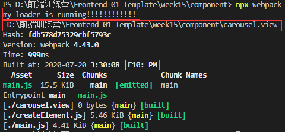
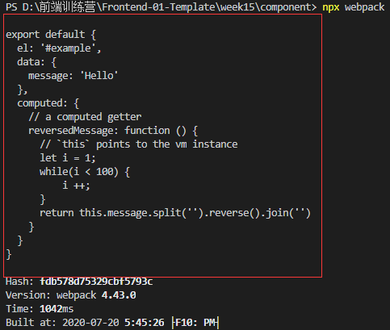
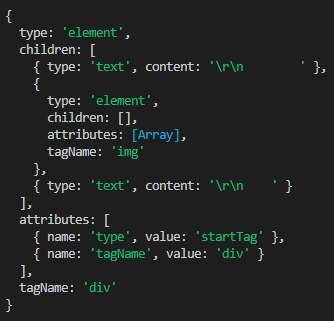
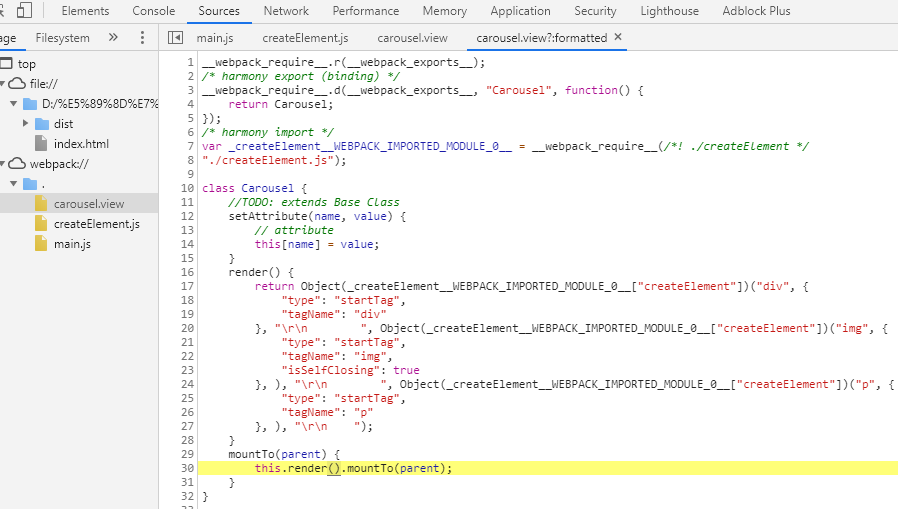
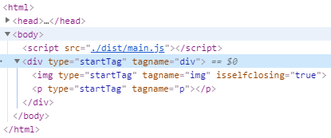

# 组件化 | One more thing：Vue 风格的 SFC

## 前言 
上一节熟悉了组件化 React JSX 风格的模式，在webpack里使用`@babel/plugin-transform-react-jsx`插件将render函数中标签转化为创建dom函数，然后完善这个函数实现组件的功能。  
这节我们来学习组件化的另外一种模式，Vue 风格的 SFC（single-file-component）单文件组件模式。

## SFC（single-file-component）
[SFC（single-file-component）](https://vuejs.org/v2/guide/single-file-components.html)是比较流行的一种描述组件的方法。格式如下：  


实现的基本思路是自定义一种单文件组件文件类型，再通过webpack自定义一个loader来解析该文件，解析后会生成一个虚拟的js文件，该文件再经过babel转换后最终打包完成。  

## 1. webpack配置中的文件解析规则
要实现SFC组件，需要写一个webpack的loader。webpack的loader是可以自定义的。详细可查看[官方文档](https://webpack.js.org/contribute/writing-a-loader/#setup)。  
先看`webpack.config.js`的结构：
```javascript
const path = require('path');
module.exports = {
  //...
  module: {
    rules: [
      {
        test: /\.js$/,
        use: [
          {
            loader: path.resolve('path/to/loader.js'), // 加载这个js文件作为loader
            options: {/* ... */}
          }
        ]
      }
    ]
  }
};
```
上边这个 rule 的配置的作用便是用`path/to/loader.js`这个loader文件来解析`.js`后缀的文件。因此，我们可以配置一条规则，用指定 loader 解析指定文件类型。

## 2. loader的结构
`path.resolve("myloader.js")` 加载这个loader.js文件作为自定义的loader，再看一下[文档中loader.js的主体结构](https://webpack.js.org/contribute/writing-a-loader/#loader-utilities)。
```javascript
export default function(source) {
  // Apply some transformations to the source...
  return `export default ${ JSON.stringify(source) }`;
}
```
loader.js的主体是export一个function，这个function输入是source，输出是一个字符串，可以把源文件的代码转换到新文件里了。 

该loader的作用相似于之前toy-browser里的[parser.js](../week07/toy-browser/parser.js)的作用，parser.js的作用就是把HTML代码转为DOM（DOM相对于HTML的关系类似于AST相对于编程语言），因此把parser.js可以直接拿过来用。

## 3. 自定义SFC文件
新建一个文件，命名为`carousel.view`（可自定义），这个就是类似于vue的模板文件的文件，在这里写一个Vue风格的用于测试的模板内容：
```html
<template>
    <div>
        
        <p></p>
    </div>
</template><script>
export default {
  el: '#example',
  data: {
    message: 'Hello'
  },
  computed: {
    // a computed getter
    reversedMessage: function () {
      // `this` points to the vm instance
      let i = 1;
      while(i < 100) {
          i ++;
      }
      return this.message.split('').reverse().join('')
    }
  }
}
</script>
```  
## 4. 配置自定义的loader来解析自定义的SFC
现在我们在webpack.config.js的 rules 里添加一条规则，使我们自定义的模板文件用我们自定义的loader解析，先添加rule：
```javascript
const path = require('path');
module.exports = {
  //...
  module: {
    rules: [
      {
        test: /\.js$/,
        use: [
          {
            loader: path.resolve('path/to/loader.js'), // 加载这个js文件作为loader
            options: {/* ... */}
          }
        ]
      },
      {
        test: /\.view/,  // 自定义的模板文件的后缀
        use: {
            loader: require.resolve("./myloader.js") // 用自定义的myloader解析
        }
      }
    ]
  }
};
```

## 5. loader的内容
新建myloader.js内容如下:
```javascript
module.exports = function (source, map) {
    console.log("my loader is running!!!!!!!!!!!!\n", this.resourcePath); 
    //this.resourcePath为加载要解析的文件的路径
    return ""
}
```
在入口文件main.js里引入view
```javascript
import {Carousel} from "./carousel.view"
```
现在，命令行运行`npx webpack`打包，就可以用myloader解析.view文件了，结果如下：  

  

## 6. 完善toy-browser浏览器的parser
下面修改[parser.js](./parser.js)使之能处理解析`<script>`标签以及标签内的内容。
```javascript
// ...
function scriptData(c){
    // in script 
}
function scriptDataLessThanSign(c){
    // in script received < 
}
function scriptDataEndTagOpen(c){
    // in script received </ 
}
function scriptDataEndTagNameS(c){
    // in script received </s
}
function scriptDataEndTagNameC(c){
    // in script received </sc
}
function scriptDataEndTagNameR(c){
    // in script received </scr
}
function scriptDataEndTagNameI(c){
    // in script received </scri
}
function scriptDataEndTagNameP(c){
    // in script received </scrip
}
function scriptDataEndTag(c){
    // in script received </script
}
// ...
module.exports.parseHTML = function parseHTML(html){
    let state = data;
    for(let c of html) {
        state = state(c);
        // 新增一句进入script的判断
        if(stack[stack.length - 1].tagName === "script" && state === data){
            state = scriptData;
        }
    }
    state = state(EOF);
    return stack[0];
}
```

现在parser.js里的状态机可以处理script标签和标签内的内容，现在修改myloader.js可以得到正确的对.view文件的解析结果。

```javascript
var parser = require("./parser.js");
module.exports = function (source, map) {
    let tree = parser.parseHTML(source); // 解析为DOM树
    console.log(tree.children[1].children[0].content); // 获取script标签内的JS文本
    return ""
}
```
命令行运行`npx webpack`，`tree.children[1].children[0].content`便可以获取到解析后DOM树的script内的js文本内容：  

  

## 7. 完善myloader
上边tree可以拿到parser.js解析后的DOM，我们首先要拿到template标签内的内容，这通过filter可以得到：
```javascript
let template = null;
for(let node of tree.children){
    if(node.tagName === "template"){
        // 拿到template节点的不是text类型的子节点，也就是<div></div>
        template = node.children.filter(node => node.type !== "text")[0];
    }
    if(node.tagName === "script"){ //
        script = node.children[0].content;
    }
}
```
得到的template的结果：  
  

## 7.1 递归生成DOM构建函数
DOM构建函数createElement(Cls, attrs, ...children)，最终我们的目的是要得到如下结构：
```javascript
createElement("div", {"type":"startTag","tagName":"div"}, 
    "\r\n        ",
    createElement("img", {"type":"startTag","tagName":"img","isSelfClosing":true}, ),
    "\r\n        ",
    createElement("p", {"type":"startTag","tagName":"p"}, ),
    "\r\n    "
);
```
这需要用递归的方法，遍历节点的children，生成createElement的children。
```javascript
module.exports = function (source, map) {
    // ...
    let visit = (node) => {
        if(node.type === "text") // 文本节点没有attribute，单独做处理
            return JSON.stringify(node.content); 
        
        let attrs = {}
        for(let attribute of node.attributes) {
            attrs[attribute.name] = attribute.value;
        }
        let children = node.children.map(node => visit(node));  // 递归返回createElement嵌套字符串

        return `createElement("${node.tagName}", ${JSON.stringify(attrs)}, ${children})`
    }
}
```
## 7.2 返回转换后的字符串
`myloader.js`最终需要返回字符串输出为解析后的虚拟js文件，使用字符串模板，在render方法内调用上边定义的递归函数`visit(template)`递归得到DOM构建方法字符串。
```javascript
module.exports = function (source, map) {
    //  ....
    return `
import {createElement, Text, Wrapper} from "./createElement";
export class Carousel{ // TODO：extends Base Class
    setAttribute(name, value){ // attribute
        this[name] = value;
    }
    render(){
        return ${visit(template)};
    }
    mountTo(parent){
        this.render().mountTo(parent);
    }
};
`
}
```
命令行`npx webpack`打包，`carousel.view`被成功编译成了如下结构：  

  

DOM树也已经渲染在了浏览器里：  

  

## 总结

至此，我们完成了对自定义SFC文件的基本的解析打包，相对于JSX的将组件标签写在render函数里，vue风格的SFC将组件模板独立出一个文件，然后用自定义的loader解析，这两种方式都是比较流行的组件化的方式。  

但无论形式怎么变，组件的最重要的设计思想都是不变的，也就是[组件化基础](../week14/NOTE.md)的八大特性（Property、Methods、Inherit、Attribute、Config&State、Event、Lifecycle、Children），只有设计好这些特性，组件体系才会清晰，至于最终具体使用JSX做还是SFC做，这只是具体的实现方式的区别而已。  

另外，站在更高的角度看一个组件体系应该有的分类，分别应该设计成什么样，这也是很关键的。