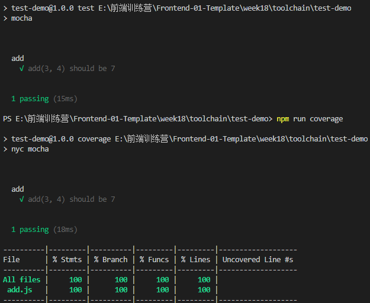
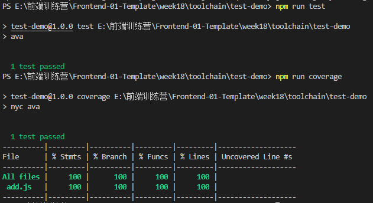
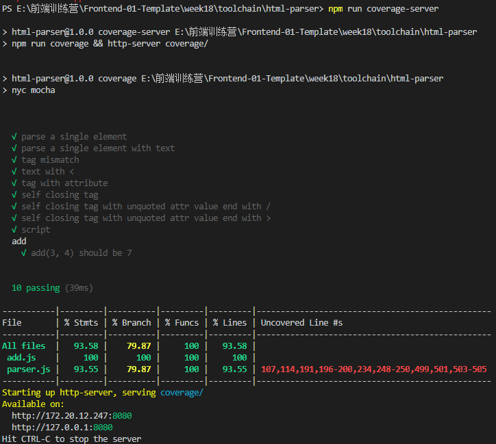

# 工具链

## Dev 工具
* Server
    * build： webpack babel vue jsx postcss
    * watch：fsevent
    * mock：
    * http：ws
* Client
    * debugger：vscode devtool
    * source map

bulid是前端主体工具，大部分前端基础设施都依赖build环境。

webpack最早是为nodejs设计的，支持require语法，但会有动态字符串路径，出现问题。推荐使用import语法，可以静态分析，不需要将js完整解析就能拿到import。

VS Code Debugger过程：
DEBUG CONSOLE 通过node启动js文件，在启动一个Debugger Server，这个Debugger Server与V8在同一个进程里，所以可以控制V8，VS Code作为一个Client与Debugger Server通过websocket:`ws://127.0.0.1:54787/2d4d9d68-7325-443d-8c84-2c876dd257e8`通讯，传递在客户端上打断点/写`debugger`等命令。

Chrome的Devtools也是Client，Webkit才是Server。

```
E:\software\nodejs\node.exe .\week18\toolchain\watcher\watcher.js
Debugger listening on ws://127.0.0.1:54787/2d4d9d68-7325-443d-8c84-2c876dd257e8
For help, see: https://nodejs.org/en/docs/inspector
Debugger attached.
```

Source map并未形成标准。

使用node`child_process`模块的exec，可以执行命令行，但是在vscode中调试时，命令的执行路径是工作目录basepath，跟cd到的路径没有关系。

## 单元测试
[mocha](https://www.npmjs.com/package/mocha)/[ava](https://www.npmjs.com/package/ava)可以单元测试，[nyc](https://www.npmjs.com/package/nyc) （ES loader）与前两者之一配合可以测试代码覆盖率。
mocha配合`esm`或`istanbul`可以支持`import`语法。  

* `mocha`/ `nyc mocha` 测试输出结果： 

    

* `ava` / `nyc ava` 测试输出结果：  



尝试测试Toy-browser的parser.js，新建`./test/parser.test.js`文件，内容如下：
```javascript
import {parseHTML} from "../src/parser.js"
let assert = require("assert")

it('parse a single element', () => {
    let doc = parseHTML("<div></div>");
    let div = doc.children[0];
    assert.equal(div.type, "element");
})
// other test code...
```

`nyc mocha`命令便可以测试覆盖率:  

  

代码覆盖率测试一般是用行覆盖率，函数覆盖率太宽松，分支覆盖率太严格。DOM的case一般不放在单元测试，一般用无头浏览器。